# causality and flutter_causality

causality: 

flutter_causality: 

## Motivation

I wanted to have a system in place that works like you would describe stuff
happening in the real world as well. Cause and effect came to my mind.

`causality` contains the pure Dart package and `flutter_causality` contains
the Flutter related extensions.

## Supported Features

### causality

- ✅ Emit causes
- ✅ Effects observe causes
- ✅ Effects can result in new causes to be emitted

### flutter_causality

- ✅ Put a causality universe widget in the wigdet tree
- ✅ Put an effect widget in the widget tree to observe causes

## Explanation

See some explanatory examples in the diagram below:

- `Effect1` and `Effect2` both observe `Cause1`
- `Effect1` emits 3 causes as its result
- `Effect2` does not emit any resulting causes
- `Effect2` observes `Cause4`, which is a cause emitted from `Effect1`

```mermaid
stateDiagram-v2
direction LR

classDef cause fill:green
classDef effect fill:blue

Cause1 --> Effect1

Effect1 --> Cause2
Effect1 --> Cause3
Effect1 --> Cause4

Cause1 --> Effect2

Cause4 --> Effect2

Effect2 --> [*]

class Cause1 cause
class Cause2 cause
class Cause3 cause
class Cause4 cause
class Effect1 effect
class Effect2 effect
```

