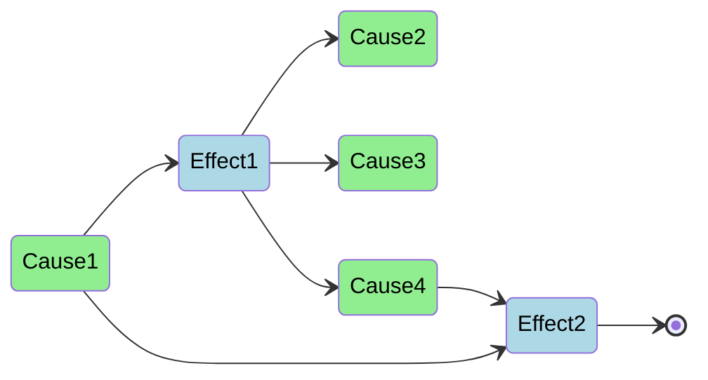

# causality


## Motivation

I wanted to have a system in place that works like you would describe stuff
happening in the real world as well. Cause and effect came to my mind.

## Supported Features

- ✅ emit causes
- ✅ effects observe causes
- ✅ effects can result in new causes to be emitted

## Installation

As simple as `dart pub add causality`.

Or manually add `causality: ^<version>` to your `pubspec.yaml`.

## Examples

### Declaring causes

```dart
class DataRequestedCause extends Cause {}

class DataAvailableCause extends Cause {
  DataAvailableCause(this.data);

  final String data;
}
```

### Declaring effects

```dart
final getDataEffect = Effect(
  (_) async => [
    // perform your API request here for example
    DataAvailableCause('data'),
  ],
);
```

### Observing causes

```dart
printDataEffect.observe(
  [
    DataAvailableCause,
  ],
  universe: causalityUniverse,
);
```

## Explanation

See some explanatory examples in the diagram below:

- `Effect1` and `Effect2` both observe `Cause1`
- `Effect1` emits 3 causes as its result
- `Effect2` does not emit any resulting causes
- `Effect2` observes `Cause4`, which is a cause emitted from `Effect1`


